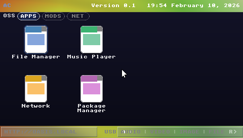
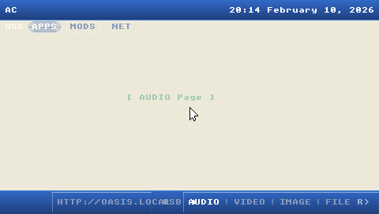
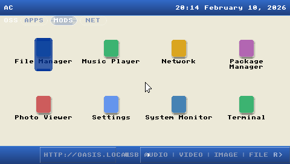

# OASIS_OS

An embeddable operating system framework in Rust. Renders a skinnable shell interface -- scene-graph UI, command interpreter, virtual file system, plugin system, remote terminal -- anywhere you can provide a pixel buffer and an input stream.

| Dashboard (Apps) | Terminal |
|:---:|:---:|
|  |  |

| Media Tab | Mods Tab |
|:---:|:---:|
|  |  |

## Overview

OASIS_OS originated as a Rust port of a PSP homebrew shell OS written in C circa 2006-2008. The trait-based backend system designed for cross-platform portability extends to four rendering targets:

| Target | Backend | Renderer | Input | Status |
|--------|---------|----------|-------|--------|
| Desktop / Raspberry Pi | `oasis-backend-sdl` | SDL2 window | Keyboard, mouse, gamepad | Implemented |
| PSP / PPSSPP | `oasis-backend-psp` | sceGu hardware sprites | PSP controller | Implemented |
| Unreal Engine 5 | `oasis-backend-ue5` | Software RGBA framebuffer | FFI input queue | Implemented |
| Framebuffer (headless Pi) | Planned | `/dev/fb0` direct writes | evdev | Planned |

The framework supports multiple **skins** that determine visual layout and feature gating. The Classic skin (implemented) renders a PSIX-style dashboard with document icons, tabbed navigation (OSS / APPS / MODS / NET), status bar, and chrome bezels at 480x272 native resolution. Additional skins (Terminal, Tactical, Corrupted, Desktop, Agent Terminal) are planned.

## Crates

```
oasis-os/
+-- Cargo.toml                        # Workspace root (resolver="2", edition 2024)
+-- crates/
|   +-- oasis-core/                   # Platform-agnostic framework (SDI, VFS, commands, skins, WM)
|   +-- oasis-backend-sdl/            # SDL2 rendering and input (desktop + Pi)
|   +-- oasis-backend-ue5/            # UE5 software framebuffer + FFI input queue
|   +-- oasis-backend-psp/            # [EXCLUDED] sceGu hardware rendering, PSP controller (std via rust-psp)
|   +-- oasis-ffi/                    # C FFI boundary for UE5 integration
|   +-- oasis-app/                    # Binary entry points: desktop app + screenshot tool
+-- skins/
|   +-- classic/                      # PSIX-style icon grid dashboard (implemented)
+-- docs/
    +-- design.md                     # Technical design document (v2.3)
```

| Crate | Description |
|-------|-------------|
| `oasis-core` | Platform-agnostic core: scene graph (SDI), backend traits, input pipeline, config/theming, virtual file system, window manager, command interpreter, plugin interface |
| `oasis-backend-sdl` | SDL2 rendering and input backend for desktop and Raspberry Pi |
| `oasis-backend-ue5` | UE5 render target backend -- software RGBA framebuffer and FFI input queue |
| `oasis-backend-psp` | PSP hardware backend -- sceGu sprite rendering, PSP controller input, std via [rust-psp](https://github.com/AndrewAltimit/rust-psp) SDK |
| `oasis-ffi` | C-ABI FFI boundary (`cdylib`) for UE5 and external integrations |
| `oasis-app` | Desktop entry point (SDL2) and screenshot capture tool |

The PSP backend is excluded from the workspace (requires `mipsel-sony-psp` target) and depends on the standalone [rust-psp SDK](https://github.com/AndrewAltimit/rust-psp) via git dependency.

## Building

### Desktop (SDL2)

```bash
# Via Docker (container-first)
docker compose --profile ci run --rm rust-ci cargo build --release -p oasis-app

# Or natively (requires libsdl2-dev, libsdl2-mixer-dev)
cargo build --release -p oasis-app
```

### PSP (EBOOT.PBP)

Requires the nightly Rust toolchain with `rust-src` and `cargo-psp`:

```bash
cd crates/oasis-backend-psp
RUST_PSP_BUILD_STD=1 cargo +nightly psp --release
# Output: target/mipsel-sony-psp-std/release/EBOOT.PBP
```

### UE5 (FFI Library)

```bash
cargo build --release -p oasis-ffi
# Output: target/release/liboasis_ffi.so (or .dll on Windows)
```

## PSP Testing (PPSSPP)

The repo includes a containerized PPSSPP emulator with NVIDIA GPU passthrough for testing PSP EBOOTs:

```bash
# Build the PPSSPP Docker image (first time only)
docker compose --profile psp build ppsspp

# Run with GUI (requires X11 display)
docker compose --profile psp run --rm ppsspp /roms/release/EBOOT.PBP

# Run headless (CI / no display -- exits TIMEOUT on success)
docker compose --profile psp run --rm -e PPSSPP_HEADLESS=1 ppsspp /roms/release/EBOOT.PBP --timeout=5

# Run with interpreter (more stable for some MIPS code paths)
docker compose --profile psp run --rm -e PPSSPP_HEADLESS=1 ppsspp /roms/release/EBOOT.PBP -i --timeout=5
```

The `/roms/` mount maps to `crates/oasis-backend-psp/target/mipsel-sony-psp-std/` so both `release/` and `debug/` EBOOTs are available. Headless mode exits with `TIMEOUT` on success (OASIS_OS runs an infinite render loop). Any crash produces a non-zero exit code.

## CI

All CI stages run in Docker containers on a self-hosted runner:

```bash
# Build the CI container
docker compose --profile ci build

# Format check
docker compose --profile ci run --rm rust-ci cargo fmt --all -- --check

# Clippy
docker compose --profile ci run --rm rust-ci cargo clippy --workspace -- -D warnings

# Tests
docker compose --profile ci run --rm rust-ci cargo test --workspace

# License/advisory check
docker compose --profile ci run --rm rust-ci cargo deny check
```

GitHub Actions workflows run the full pipeline automatically on push to `main` and on pull requests, including PSP EBOOT build + PPSSPP headless testing, AI code review (Gemini + Codex), and automated fix agents.

## Documentation

- [Technical Design Document](docs/design.md) -- architecture, backends, skins, UE5 integration, PSP implementation, VFS, plugin system, security considerations, migration strategy (v2.3, 1300+ lines)

## License

MIT
