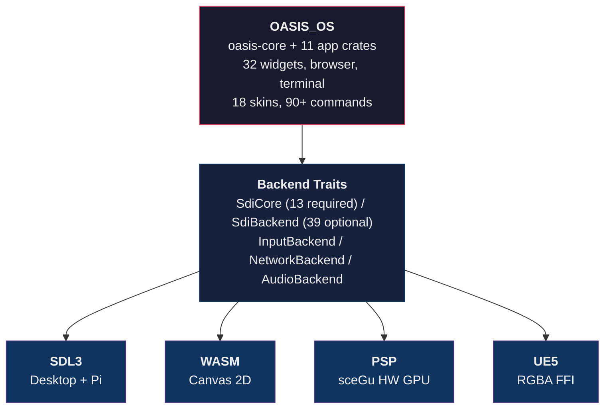

# OASIS_OS

An embeddable operating system framework in Rust. One codebase renders a full desktop environment -- window manager, browser engine, terminal, 16 apps, 18 skins -- to a 333 MHz PSP handheld, a desktop GPU, a web browser, and an Unreal Engine 5 viewport. Give it a pixel buffer and an input stream and it runs anywhere.

**[Try it in your browser](https://andrewaltimit.github.io/oasis-os/demo/)** -- no install required.

https://github.com/user-attachments/assets/8e12988e-fb1a-4a4e-a0e5-e1f04d8cd433

**[All 18 skin screenshots](SCREENSHOTS.md)** | **[Developer's Journal](https://andrewaltimit.github.io/oasis-os/journal/)**

| Altimit | Paper | XP | Win95 | Retro CGA |
|:---:|:---:|:---:|:---:|:---:|
|  |  |  |  |  |

| macOS | GNOME | Balatro | Solarized | Vaporwave |
|:---:|:---:|:---:|:---:|:---:|
|  |  |  |  |  |

## The PSP Story

OASIS_OS was built from scratch in Rust starting in early 2026, inspired by PSP homebrew shells like PSIX. The PSP is both the original muse and the most demanding target -- and the most interesting.

The PSP is a 2004 handheld with a 333 MHz MIPS CPU, 32 MB RAM, and firmware from 2008. Making a modern streaming video app work on it required:

- **TLS 1.3 in pure Rust** -- Sony's firmware ships SSL 3.0 with 2008 root CAs. We implemented native TLS 1.3 via `embedded-tls` on bare metal MIPS, discovering privileged instruction traps (`mfc0 $9` is COP0-protected on Allegrex), RSA handshake failures (need the `alloc` feature for RSA scheme advertisement), and DNS endianness bugs. This enables HTTPS connections to modern servers like archive.org.

- **Hardware H.264 video decode** -- The PSP's Media Engine is a second MIPS CPU dedicated to multimedia. No public documentation exists for using it from homebrew. We [reverse engineered the ME's RPC protocol](https://andrewaltimit.github.io/oasis-os/journal/07-psp-media-engine.html) -- 22 command IDs, 47 internal NIDs, the complete kernel driver chain -- discovered undocumented `sceMpegCreate` parameters in PMPlayer's source code, and achieved hardware-accelerated H.264 decode from Rust. A firmware deadlock at ~70 frames is handled by a kernel PRX watchdog that hooks `sceKernelWaitEventFlag` with a timeout, plus P/B-frame skipping for indefinite stable streaming.

- **In-memory video streaming** -- The TV Guide app streams MP4 from archive.org over TLS 1.3, demuxes on the fly, feeds H.264 NAL units to the ME for video and AAC frames to `sceAudiocodec` for audio, all in separate threads with lock-free queues and semaphore-based wakeup. No disk I/O during playback.

- **Kernel-mode overlay plugin** -- A separate PRX binary hooks `sceDisplaySetFrameBuf` to draw an overlay UI on top of any running game's framebuffer, with background MP3 playback via the ME.

- **Closed-loop remote development** -- A [TCP command server](https://andrewaltimit.github.io/oasis-os/journal/08-remote-dev-automation.html) inside the EBOOT provides WiFi-based build-deploy-reboot-test cycles, remote input injection, live framebuffer streaming, and arbitrary file upload. A network recovery EBOOT (154 KB, triggered by holding R-trigger on boot) makes the device unbrickable over WiFi. An AI agent used this infrastructure to debug the entire H.264 pipeline -- 30+ deploy-test iterations in a single session without touching the device.

https://github.com/user-attachments/assets/psp-closed-loop-automation

*Closed-loop demo: AI agent connects to PSP over WiFi, launches TV Guide, tunes a channel, windows the app, then power-cycles via USB relay-controlled actuator -- zero human contact.*

Read the full technical deep dives in the [Developer's Journal](https://andrewaltimit.github.io/oasis-os/journal/).

## Architecture: Write Once, Render Anywhere

Core code never calls platform APIs directly. All rendering, input, networking, and audio flow through backend traits defined in `oasis-types`. Implement 13 methods and you have a working backend; opt into up to 39 more for accelerated rendering.


```mermaid
graph TD
    APP["<b>OASIS_OS</b><br/>oasis-core + 11 app crates<br/>32 widgets, browser, terminal<br/>18 skins, 90+ commands"]
    TRAITS["<b>Backend Traits</b><br/>SdiCore (13 required) / SdiBackend (39 optional)<br/>InputBackend / NetworkBackend / AudioBackend"]

    SDL["<b>SDL3</b><br/>Desktop + Pi"]
    WASM["<b>WASM</b><br/>Canvas 2D"]
    PSP["<b>PSP</b><br/>sceGu HW GPU"]
    UE5["<b>UE5</b><br/>RGBA FFI"]

    APP --> TRAITS
    TRAITS --> SDL
    TRAITS --> WASM
    TRAITS --> PSP
    TRAITS --> UE5

    style APP fill:#1a1a2e,stroke:#e94560,color:#eee
    style TRAITS fill:#16213e,stroke:#0f3460,color:#eee
    style SDL fill:#0f3460,stroke:#533483,color:#eee
    style WASM fill:#0f3460,stroke:#533483,color:#eee
    style PSP fill:#0f3460,stroke:#533483,color:#eee
    style UE5 fill:#0f3460,stroke:#533483,color:#eee
```

## Key Features

**Browser Engine**
- HTML/CSS renderer with DOM, CSS cascade, flex/grid/table layout, full 2D CSS transforms
- Canvas 2D path API, SVG paths with fill-rule/linecap/linejoin
- Light compositor: display list batching, occlusion culling, clip intersection, sticky scroll caching
- Hover-triggered CSS transitions, `@media`/`@supports` queries, `calc()`, custom properties
- Form elements with select dropdown, label association, Tab focus, GET/POST submission
- JavaScript engine (QuickJS-NG): DOM manipulation, event dispatch, `fetch()`, `localStorage`

**Shell & Apps**
- 90+ terminal commands across 17 modules with piping, globs, aliases, variable expansion
- 16 built-in apps: File Manager, Browser, TV Guide, Internet Radio, Paint, Games, Calculator, Clock, Text Editor, Settings, and more
- TV Guide streams video from Internet Archive with hardware H.264 decode (PSP) or software decode (desktop)
- Internet Radio streams MP3 from curated Internet Archive collections

**Rendering & UI**
- Scene graph (SDI) with z-order, gradients, rounded corners, shadows, alpha blending
- 32 widgets: Button, Card, TabBar, ListView, ScrollView, Slider, TreeView, Modal, and more
- Window manager with drag/resize, minimize/maximize, snap zones
- 20 data-driven TOML skins with theme derivation from 9 base colors
- Vector graphics with path operations and frame-driven animations
- GPU shader wallpapers (Shadertoy-style: Voronoi, City Lights, Ocean Waves, Balatro)

**Networking & Platform**
- TLS 1.3 in pure Rust via `embedded-tls` (enables HTTPS on PSP hardware)
- Software MP4/H.264+AAC video decode (desktop); hardware ME decode (PSP)
- Remote terminal with PSK authentication for headless management
- Plugin system with VFS-based IPC and manifest discovery
- Virtual file system: `MemoryVfs` (in-RAM), `RealVfs` (disk), `GameAssetVfs` (UE5)

**PSP-Specific**
- Hardware GU rendering via `sceGu` with sprite batching and VRAM texture cache
- Media Engine H.264 decode with kernel PRX watchdog for deadlock recovery
- WiFi auto-connect, TCP command server, remote input injection, live screencap
- Network recovery EBOOT for remote unbricking (154 KB, WiFi TCP file server)
- Kernel-mode overlay PRX: in-game UI + background MP3 via ME coprocessor
- Hardware AAC decode via `sceAudiocodec`, proportional bitmap + system TrueType fonts

## Skins

All 18 skins are defined in TOML configuration with theme derivation from 9 base colors. No code changes required. See the [Skin Authoring Guide](docs/skin-authoring.md).

| Category | Skins |
|----------|-------|
| **Desktop** | xp, macos, gnome, win95, desktop, modern |
| **Dashboard** | classic, altimit |
| **Aesthetic** | balatro, vaporwave, solarized, paper |
| **Terminal** | terminal, tactical, corrupted, agent-terminal |
| **Accessibility** | highcontrast, retro-cga |

Skins support animated shader wallpapers (Shadertoy-style fragment shaders: Voronoi, City Lights, Ocean Waves, Calm Waves, Balatro) that render in real-time behind the UI.

Default virtual resolution is 480x272 (PSP native). Skins may override this (e.g. modern=800x600, xp=1024x768); the backend canvas/window scales to match.

## Crates

37 crates (35 workspace + 2 excluded PSP crates):

| Layer | Crates | Description |
|-------|--------|-------------|
| **Foundation** | `oasis-types`, `oasis-vfs`, `oasis-platform` | Backend traits, virtual file system, platform service traits |
| **Rendering** | `oasis-sdi`, `oasis-ui`, `oasis-wm`, `oasis-skin`, `oasis-vector`, `oasis-shader`, `oasis-rasterize` | Scene graph, 32 widgets, window manager, 18 TOML skins, vector graphics, shader wallpapers |
| **Content** | `oasis-browser`, `oasis-js`, `oasis-terminal`, `oasis-video`, `oasis-i18n` | HTML/CSS/JS engine, 90+ commands, MP4/H.264 decode |
| **Infrastructure** | `oasis-net`, `oasis-audio`, `oasis-core` | TCP/PSK networking, audio playback, coordination layer |
| **Apps** | `oasis-app-core`, `oasis-app-*` (11 crates) | Games, Paint, Clock, Text Editor, Calculator, Media, TV Guide, Radio, Settings, File Manager |
| **Backends** | `oasis-backend-sdl`, `-wasm`, `-ue5`, `-psp`, `oasis-plugin-psp`, `oasis-ffi` | SDL3/Desktop, Canvas 2D/Browser, UE5 FFI, PSP sceGu, Kernel PRX overlay |

## Building

### Desktop (SDL3)

```bash
cargo build --release -p oasis-app

# Or via Docker (matches CI)
docker compose --profile ci run --rm rust-ci cargo build --release -p oasis-app
```

### WebAssembly (Browser)

```bash
./scripts/build-wasm.sh --release    # requires wasm-pack
python3 -m http.server 8080          # serve at http://localhost:8080/www/
```

### PSP

```bash
# EBOOT (main application)
cd crates/oasis-backend-psp
RUST_PSP_BUILD_STD=1 cargo +nightly psp --release

# Kernel overlay plugin (PRX)
cd crates/oasis-plugin-psp
RUST_PSP_BUILD_STD=1 cargo +nightly psp --release

# Network recovery EBOOT
cd crates/oasis-recovery-psp
RUST_PSP_BUILD_STD=1 cargo +nightly psp --release
```

### UE5 (FFI Library)

```bash
cargo build --release -p oasis-ffi
```

### Screenshots

```bash
cargo run -p oasis-app --bin oasis-screenshot          # classic (default)
cargo run -p oasis-app --bin oasis-screenshot xp       # any skin by name
```

## Environment Variables

| Variable | Description | Example |
|----------|-------------|---------|
| `OASIS_SKIN` | Override the default skin at startup | `OASIS_SKIN=modern cargo run -p oasis-app` |
| `OASIS_APP` | Auto-launch a named app on startup | `OASIS_APP=Browser` |
| `OASIS_URL` | Navigate the browser to a URL on startup (requires `OASIS_APP=Browser`) | `OASIS_URL="vfs://sites/home/js-test.html"` |

## PSP Remote Development

The PSP backend includes a TCP command server for closed-loop development. See the [Developer's Journal Entry 08](https://andrewaltimit.github.io/oasis-os/journal/08-remote-dev-automation.html) for the full design.

```bash
# Deploy EBOOT over WiFi
./scripts/psp-devloop.sh cycle target/.../EBOOT.PBP

# Remote UI control
./scripts/psp-devloop.sh tcp-press cross
./scripts/psp-devloop.sh tcp-screencap /tmp/psp.png

# Upload kernel plugin
./scripts/psp-devloop.sh tcp-upload oasis.prx ms0:/seplugins/oasis.prx
```

## PSP Testing (PPSSPP)

The repo includes a containerized PPSSPP emulator with NVIDIA GPU passthrough:

```bash
docker compose --profile psp build ppsspp                                                     # first time only
docker compose --profile psp run --rm ppsspp /roms/release/EBOOT.PBP                          # GUI (X11)
docker compose --profile psp run --rm -e PPSSPP_HEADLESS=1 ppsspp /roms/release/EBOOT.PBP --timeout=5  # headless
```

## CI

All CI runs in Docker on a self-hosted runner:

format check -> clippy -> nightly clippy -> docs -> markdown links -> tests -> release build -> screenshot regression -> cargo-deny -> benchmarks -> PSP EBOOT + PPSSPP headless -> coverage -> WASM deploy

## Documentation

- [Technical Design](docs/design.md) -- architecture, backends, skins, PSP, VFS, plugins, security (v2.4, 1300+ lines)
- [Getting Started](docs/getting-started.md) -- setup, building, testing
- [Skin Authoring Guide](docs/skin-authoring.md) -- TOML reference, theme derivation, effects
- [Adding Commands](docs/adding-commands.md) -- terminal command development
- [Plugin Development](docs/plugin-development.md) -- plugin API, VFS-based IPC
- [FFI Integration](docs/ffi-integration.md) -- C API for UE5 and external hosts
- [PSP Plugin Guide](docs/psp-plugin.md) -- overlay PRX installation and controls
- [Troubleshooting](docs/troubleshooting.md) -- common issues and solutions
- [ADR Index](docs/adr/) -- architectural decision records
- [Developer's Journal](https://andrewaltimit.github.io/oasis-os/journal/) -- technical deep dives (TLS on PSP, ME reverse engineering, remote automation)

## Security Notice

> **OpenAI/Codex integrations are disabled.** OpenAI permits government partners unrestricted use of its models within their own definition of legality. Anthropic maintains explicit prohibitions on mass surveillance and autonomous weapons. We default to the stricter policy. To re-enable at your own risk: `CODEX_ENABLED=true`.

## License

Dual-licensed under [MIT](LICENSE-MIT) and [Unlicense](LICENSE).
