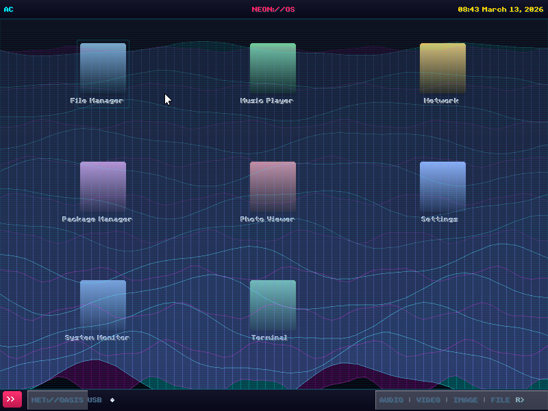
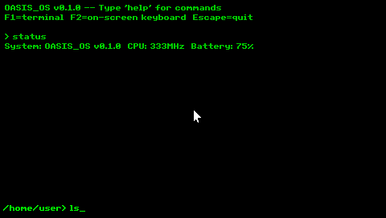
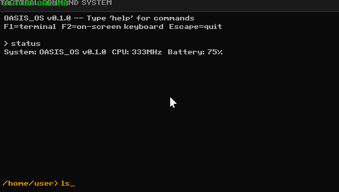
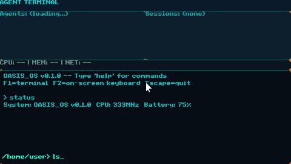
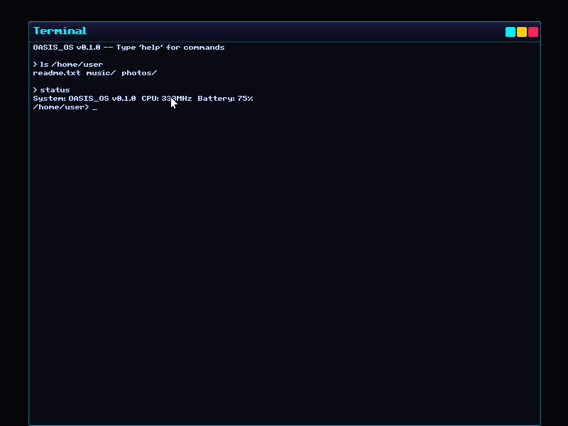

# OASIS_OS

An embeddable operating system framework in Rust. Renders a skinnable shell interface -- scene-graph UI, command interpreter, virtual file system, browser engine, plugin system, remote terminal -- anywhere you can provide a pixel buffer and an input stream.

### Dashboards

| Classic | XP | Modern | Desktop | macOS |
|:---:|:---:|:---:|:---:|:---:|
|  |  |  |  |  |

| GNOME | Cyberpunk | Win95 | Solarized | Vaporwave |
|:---:|:---:|:---:|:---:|:---:|
|  |  |  |  |  |

| Retro CGA | Paper | High Contrast |
|:---:|:---:|:---:|
|  |  |  |

### Terminals

| Classic | XP | Modern | Desktop | macOS |
|:---:|:---:|:---:|:---:|:---:|
|  |  |  |  |  |

| Terminal | Tactical | Corrupted | Agent Terminal | Cyberpunk |
|:---:|:---:|:---:|:---:|:---:|
|  |  |  |  |  |

| Win95 | Solarized | Vaporwave | High Contrast | GNOME |
|:---:|:---:|:---:|:---:|:---:|
|  |  |  |  |  |

## Overview

OASIS_OS originated as a Rust port of a PSP homebrew shell OS written in C circa 2006-2008. The trait-based backend system designed for cross-platform portability extends to five rendering targets:

| Target | Backend | Renderer | Input | Status |
|--------|---------|----------|-------|--------|
| Desktop / Raspberry Pi | `oasis-backend-sdl` | SDL2 window | Keyboard, mouse, gamepad | Implemented |
| WebAssembly (Browser) | `oasis-backend-wasm` | Canvas 2D API | DOM events (keyboard, mouse, touch) | Implemented |
| PSP / PPSSPP | `oasis-backend-psp` | sceGu hardware sprites | PSP controller | Implemented |
| Unreal Engine 5 | `oasis-backend-ue5` | Software RGBA framebuffer | FFI input queue | Implemented |
| Framebuffer (headless Pi) | Planned | `/dev/fb0` direct writes | evdev | Planned |

### Skins

The framework supports a data-driven **skin system** that controls visual layout, color themes, feature gating, and behavioral personality. Skins are defined in TOML configuration files -- no code changes required. Seventeen skins are implemented:

| Skin | Style | Key Features | Source |
|------|-------|-------------|--------|
| **classic** | PSIX-style icon grid dashboard | Dashboard + terminal, tabbed navigation (OSS/APPS/MODS/NET), status bar, chrome bezels | External (`skins/classic/`) |
| **xp** | Windows XP Luna-inspired blue theme | Dashboard + terminal + start menu, gradient titlebars, taskbar | External (`skins/xp/`) + Built-in |
| **macos** | macOS-inspired desktop | Window manager, traffic-light buttons, dock-style launcher | External (`skins/macos/`) |
| **gnome** | GNOME desktop style | Window manager, Activities bar, rounded elements | External (`skins/gnome/`) |
| **cyberpunk** | Neon cyberpunk aesthetic | Glowing accents, dark theme, futuristic UI | External (`skins/cyberpunk/`) |
| **retro-cga** | CGA 4-color retro | CGA palette, retro styling, nostalgic look | External (`skins/retro-cga/`) |
| **paper** | Minimalist paper/ink style | Clean, light theme, paper-like appearance | External (`skins/paper/`) |
| **terminal** | Green-on-black CRT | Terminal only, full-screen command line | Built-in |
| **tactical** | Military command console | Terminal + restricted commands, stripped-down UI | Built-in |
| **corrupted** | Glitched terminal | Terminal + corruption effects (jitter, flicker, garbling) | Built-in |
| **desktop** | Windowed desktop | Window manager + terminal, resizable/draggable windows | Built-in |
| **agent-terminal** | AI agent console | Terminal + agent/MCP commands, system health | Built-in |
| **win95** | Windows 95/98 classic look | Raised 3D borders, system gray, blue titlebars | External (`skins/win95/`) |
| **solarized** | Solarized Dark palette | Developer-focused, clean Solarized color scheme | External (`skins/solarized/`) |
| **vaporwave** | Aesthetic vaporwave | Purple, pink, and cyan gradients | External (`skins/vaporwave/`) |
| **highcontrast** | High contrast accessibility | Black background, white text, yellow accents | External (`skins/highcontrast/`) |
| **modern** | Purple accent, rounded corners | Dashboard + WM + browser, gradient fills, shadows | Built-in |

All skins share the same core: scene graph, command interpreter, virtual file system, networking, and plugin infrastructure. See the [Skin Authoring Guide](docs/skin-authoring.md) for creating custom skins.

Default virtual resolution is 480x272 (PSP native). Skins may override this (e.g. modern=800x600, xp=1024x768); the backend canvas/window scales to match.

### Key Features

- **Scene Graph (SDI)** -- Named object registry with position, size, color, texture, text, z-order, alpha, gradients, rounded corners, shadows
- **Browser Engine** -- Embedded HTML/CSS/Gemini renderer with DOM parsing, CSS cascade, block/inline/table layout, link navigation, reader mode, bookmarks. JavaScript support via QuickJS-NG with DOM manipulation (getElementById, createElement, textContent, attributes)
- **JavaScript Engine** -- Embedded QuickJS-NG runtime (`oasis-js` crate) with `console` API, inline `<script>` execution, and DOM bindings for dynamic page manipulation. Feature-gated (`javascript`) -- enabled by default on desktop
- **Window Manager** -- Movable, resizable, overlapping windows with titlebars, minimize/maximize/close, hit testing, and themed decorations
- **UI Widget Toolkit** -- 30+ reusable widgets: Button, Card, TabBar, Panel, TextField, ListView, ScrollView, ProgressBar, Toggle, NinePatch, flex layout, and more
- **Proportional Bitmap Font** -- Variable-width glyph rendering from ink bounds with per-character advance values (not fixed-width 8x8)
- **90+ Terminal Commands** -- 17+ command modules: core (fs/system), text processing (head, tail, grep, sort, uniq, tr, cut, diff), file utilities (write, tree, du, stat, xxd, checksum), dev tools (base64, json, uuid, seq, expr, test, xargs), fun (cal, fortune, banner, matrix, yes, watch, time), system (uptime, df, whoami, hostname, date, sleep), security (chmod, chown, passwd, audit), documentation (man, tutorial, motd), networking (wifi, ping, http), audio, radio, UI (wm, sdi, theme, notify, screenshot), skin switching, scripting, transfer (FTP), TV Guide, system updates. Shell features include variable expansion, glob expansion, aliases, history (!!/!n), piping, and command chaining
- **Audio System** -- Playlist management, MP3/WAV playback, ID3 tag parsing, shuffle/repeat modes, volume control
- **Plugin System** -- Runtime-extensible via `Plugin` trait, VFS-based IPC, manifest-driven discovery
- **Virtual File System** -- `MemoryVfs` (in-RAM), `RealVfs` (disk), `GameAssetVfs` (UE5 with overlay writes)
- **Remote Terminal** -- TCP listener with PSK authentication for headless device management
- **Agent/MCP Integration** -- Agent status tracking, MCP tool browsing/invocation, tamper detection, system health dashboard
- **Scripting** -- Line-based command scripts, startup scripts, cron-like scheduling
- **Internet Archive Integration** -- TV Guide streams live video from Internet Archive channels with a 1980s Prevue Channel aesthetic; Radio streams MP3 audio from curated Internet Archive collections
- **Video Playback** -- Software MP4/H.264+AAC decode pipeline (`oasis-video` crate) using symphonia for demux and AAC, optional openh264 for H.264 video frames. WASM backend renders in-canvas; PSP backend downloads to Memory Stick
- **16 Built-in Apps** -- File Manager (dual-panel Norton Commander-style), Settings, Network, Music Player, Photo Viewer, Package Manager, Browser, System Monitor, TV Guide, Internet Radio, Terminal, Text Editor, Calculator, Clock, Paint, Games

## Crates

The framework is split into 19 workspace crates plus 2 excluded PSP crates:

```
oasis-os/
+-- Cargo.toml                        # Workspace root (resolver="2", edition 2024)
+-- crates/
|   +-- oasis-types/                  # Foundation types: Color, Button, InputEvent, backend traits, error types
|   +-- oasis-vfs/                    # Virtual file system: MemoryVfs, RealVfs, GameAssetVfs
|   +-- oasis-platform/              # Platform service traits: Power, Time, USB, Network, OSK
|   +-- oasis-sdi/                    # Scene Display Interface: named object registry, z-order, rendering
|   +-- oasis-net/                    # TCP networking, PSK authentication, remote terminal, FTP transfer
|   +-- oasis-audio/                  # Audio manager, playlist, shuffle/repeat, MP3/WAV decode, ID3 parsing
|   +-- oasis-ui/                     # 20+ widgets: Button, Card, TabBar, Panel, TextField, ListView, etc.
|   +-- oasis-wm/                     # Window manager: drag/resize, hit testing, minimize/maximize/close
|   +-- oasis-skin/                   # TOML skin engine, 17 skins, theme derivation from 9 base colors
|   +-- oasis-terminal/              # Command interpreter: 90+ commands across 17 modules, shell features
|   +-- oasis-browser/               # HTML/CSS/Gemini browser: DOM, CSS cascade, block/inline/table layout
|   +-- oasis-js/                    # JavaScript engine: QuickJS-NG runtime, console API, DOM bindings
|   +-- oasis-core/                   # Coordination layer: 16 apps, dashboard, agent, plugin, script, etc.
|   +-- oasis-video/                  # Software MP4/H.264+AAC decode pipeline (symphonia + openh264)
|   +-- oasis-backend-sdl/            # SDL2 rendering and input (desktop + Pi)
|   +-- oasis-backend-wasm/           # Canvas 2D rendering, DOM input, Web Audio (browser)
|   +-- oasis-backend-ue5/            # UE5 software framebuffer + FFI input queue
|   +-- oasis-backend-psp/            # [excluded from workspace] sceGu hardware rendering, PSP controller, UMD browsing
|   +-- oasis-plugin-psp/            # [excluded from workspace] kernel-mode PRX: in-game overlay + background music
|   +-- oasis-ffi/                    # C FFI boundary for UE5 integration
|   +-- oasis-app/                    # Binary entry points: desktop app + screenshot tool
+-- www/                              # WASM web shell: index.html, index.js, style.css
+-- skins/
|   +-- classic/                      # PSIX-style icon grid dashboard
|   +-- xp/                           # Windows XP Luna-inspired theme with start menu
|   +-- macos/                        # macOS-inspired desktop with traffic-light buttons
|   +-- gnome/                        # GNOME desktop style with Activities bar
|   +-- cyberpunk/                    # Neon cyberpunk aesthetic
|   +-- retro-cga/                    # CGA 4-color retro palette
|   +-- paper/                        # Minimalist paper/ink style
|   +-- win95/                        # Windows 95/98 classic 3D borders
|   +-- solarized/                    # Solarized Dark developer palette
|   +-- vaporwave/                    # Aesthetic vaporwave palette
|   +-- highcontrast/                 # High contrast accessibility theme
+-- docs/
    +-- design.md                     # Technical design document (v2.4)
    +-- skin-authoring.md             # Skin creation guide with full TOML reference
    +-- psp-modernization-plan.md     # PSP backend modernization roadmap (9 phases, 40 steps)
```

| Crate | Description |
|-------|-------------|
| `oasis-types` | Foundation types and traits: `Color`, `Button`, `InputEvent`, `SdiBackend`, `InputBackend`, `NetworkBackend`, `AudioBackend`, error types, TLS |
| `oasis-vfs` | Virtual file system: `MemoryVfs` (in-RAM), `RealVfs` (disk), `GameAssetVfs` (UE5 with overlay writes) |
| `oasis-platform` | Platform service traits: `PowerService`, `TimeService`, `UsbService`, `NetworkService`, `OskService` |
| `oasis-sdi` | Scene Display Interface: named object registry with position, size, color, texture, text, z-order, gradients, shadows |
| `oasis-net` | TCP networking with PSK authentication, remote terminal, FTP transfer |
| `oasis-audio` | Audio manager with playlist, shuffle/repeat modes, MP3/WAV decode, ID3 tag parsing |
| `oasis-ui` | 30+ reusable widgets: Button, Card, TabBar, Panel, TextField, ListView, ScrollView, ProgressBar, Toggle, NinePatch, flex layout |
| `oasis-wm` | Window manager: movable/resizable windows, titlebar buttons, hit testing, themed decorations |
| `oasis-skin` | Data-driven TOML skin system with 17 skins (11 external TOML + 7 built-in; xp exists in both), theme derivation from 9 base colors to ~30 UI element colors |
| `oasis-terminal` | Command interpreter with 90+ commands across 17 modules, shell features (variables, globs, aliases, history, piping) |
| `oasis-browser` | Embeddable HTML/CSS/Gemini rendering engine: DOM parser, CSS cascade, block/inline/table layout, reader mode, JavaScript DOM bindings |
| `oasis-js` | JavaScript engine wrapping QuickJS-NG via rquickjs: `console` API, inline `<script>` execution, DOM manipulation from JS |
| `oasis-core` | Coordination layer: app runner (16 apps), dashboard, agent/MCP, plugin, scripting, status/bottom bars |
| `oasis-video` | Software MP4/H.264+AAC decode pipeline: symphonia for demux + AAC, optional openh264 for H.264 video frames |
| `oasis-backend-sdl` | SDL2 rendering and input backend for desktop and Raspberry Pi |
| `oasis-backend-wasm` | WebAssembly backend -- Canvas 2D rendering, DOM event input, Web Audio, iframe overlay for real web pages |
| `oasis-backend-ue5` | UE5 render target backend -- software RGBA framebuffer and FFI input queue |
| `oasis-backend-psp` | PSP hardware backend -- sceGu sprite rendering, PSP controller input, dual-panel file manager, UMD disc browsing, std via [rust-psp](https://github.com/AndrewAltimit/rust-psp) SDK |
| `oasis-plugin-psp` | PSP overlay plugin PRX -- kernel-mode companion module for in-game overlay UI and background MP3 playback |
| `oasis-ffi` | C-ABI FFI boundary (`cdylib`) for UE5 and external integrations |
| `oasis-app` | Desktop entry point (SDL2) and screenshot capture tool |

The PSP crates are excluded from the workspace (require `mipsel-sony-psp` target) and depend on the standalone [rust-psp SDK](https://github.com/AndrewAltimit/rust-psp) via git dependency. The backend compiles to an EBOOT.PBP (standalone application) with TV Guide, Internet Radio, and all core apps, while the plugin compiles to a kernel-mode PRX (resident overlay module loaded by CFW via `PLUGINS.TXT`). The WASM backend compiles to a `cdylib` via `wasm-pack` and runs in any modern browser with in-canvas video rendering for TV Guide.

## Building

### Desktop (SDL2)

```bash
# Via Docker (container-first)
docker compose --profile ci run --rm rust-ci cargo build --release -p oasis-app

# Or natively (requires libsdl2-dev, libsdl2-mixer-dev)
cargo build --release -p oasis-app
```

### WebAssembly (Browser)

Requires [wasm-pack](https://rustwasm.github.io/wasm-pack/):

```bash
# Debug build
./scripts/build-wasm.sh

# Release build (smaller + faster)
./scripts/build-wasm.sh --release

# Serve locally
python3 -m http.server 8080
# Open http://localhost:8080/www/
```

Output goes to `pkg/`; `www/index.html` imports from `../pkg/`.

### PSP (EBOOT.PBP)

Requires the nightly Rust toolchain with `rust-src` and `cargo-psp`:

```bash
cd crates/oasis-backend-psp
RUST_PSP_BUILD_STD=1 cargo +nightly psp --release
# Output: target/mipsel-sony-psp-std/release/EBOOT.PBP
```

### PSP Overlay Plugin (PRX)

```bash
cd crates/oasis-plugin-psp
RUST_PSP_BUILD_STD=1 cargo +nightly psp --release
# Output: target/mipsel-sony-psp-std/release/oasis-plugin-psp.prx
```

See [PSP Plugin Guide](docs/psp-plugin.md) for installation and usage.

### UE5 (FFI Library)

```bash
cargo build --release -p oasis-ffi
# Output: target/release/liboasis_ffi.so (or .dll on Windows)
```

### Screenshots

Capture screenshots for all skins:

```bash
# Classic skin (default)
cargo run -p oasis-app --bin oasis-screenshot

# Any skin by name
cargo run -p oasis-app --bin oasis-screenshot xp
cargo run -p oasis-app --bin oasis-screenshot modern
cargo run -p oasis-app --bin oasis-screenshot desktop
cargo run -p oasis-app --bin oasis-screenshot terminal
cargo run -p oasis-app --bin oasis-screenshot tactical
cargo run -p oasis-app --bin oasis-screenshot corrupted
cargo run -p oasis-app --bin oasis-screenshot agent-terminal
cargo run -p oasis-app --bin oasis-screenshot macos
cargo run -p oasis-app --bin oasis-screenshot gnome
cargo run -p oasis-app --bin oasis-screenshot cyberpunk
cargo run -p oasis-app --bin oasis-screenshot retro-cga
cargo run -p oasis-app --bin oasis-screenshot paper
cargo run -p oasis-app --bin oasis-screenshot win95
cargo run -p oasis-app --bin oasis-screenshot solarized
cargo run -p oasis-app --bin oasis-screenshot vaporwave
cargo run -p oasis-app --bin oasis-screenshot highcontrast
```

## Environment Variables

| Variable | Description | Example |
|----------|-------------|---------|
| `OASIS_SKIN` | Override the default skin at startup | `OASIS_SKIN=modern cargo run -p oasis-app` |
| `OASIS_APP` | Auto-launch a named app on startup | `OASIS_APP=Browser` |
| `OASIS_URL` | Navigate the browser to a URL on startup (requires `OASIS_APP=Browser`) | `OASIS_URL="vfs://sites/home/js-test.html"` |

```bash
# Launch directly into the browser with the JavaScript DOM test page
OASIS_APP=Browser OASIS_URL="vfs://sites/home/js-test.html" cargo run -p oasis-app
```

## PSP Testing (PPSSPP)

The repo includes a containerized PPSSPP emulator with NVIDIA GPU passthrough for testing PSP EBOOTs:

```bash
# Build the PPSSPP Docker image (first time only)
docker compose --profile psp build ppsspp

# Run with GUI (requires X11 display)
docker compose --profile psp run --rm ppsspp /roms/release/EBOOT.PBP

# Run headless (CI / no display -- exits TIMEOUT on success)
docker compose --profile psp run --rm -e PPSSPP_HEADLESS=1 ppsspp /roms/release/EBOOT.PBP --timeout=5

# Run with interpreter (more stable for some MIPS code paths)
docker compose --profile psp run --rm -e PPSSPP_HEADLESS=1 ppsspp /roms/release/EBOOT.PBP -i --timeout=5
```

The `/roms/` mount maps to `crates/oasis-backend-psp/target/mipsel-sony-psp-std/` so both `release/` and `debug/` EBOOTs are available. Headless mode exits with `TIMEOUT` on success (OASIS_OS runs an infinite render loop). Any crash produces a non-zero exit code.

## CI

All CI stages run in Docker containers on a self-hosted runner:

```bash
# Build the CI container
docker compose --profile ci build

# Format check
docker compose --profile ci run --rm rust-ci cargo fmt --all -- --check

# Clippy
docker compose --profile ci run --rm rust-ci cargo clippy --workspace -- -D warnings

# Tests
docker compose --profile ci run --rm rust-ci cargo test --workspace

# License/advisory check
docker compose --profile ci run --rm rust-ci cargo deny check
```

GitHub Actions workflows run the full pipeline automatically on push to `main` and on pull requests, including PSP EBOOT build + PPSSPP headless testing, screenshot regression tests, benchmarks, code coverage, AI code review (Gemini), automated fix agents, and GitHub Pages deployment (WASM build).

## Documentation

- [Technical Design Document](docs/design.md) -- architecture, backends, skins, UE5 integration, PSP implementation, VFS, plugin system, security considerations, migration strategy (v2.4, 1300+ lines)
- [Skin Authoring Guide](docs/skin-authoring.md) -- creating custom skins, TOML file reference, theme derivation, effect system, runtime switching
- [PSP Modernization Plan](docs/psp-modernization-plan.md) -- 9-phase, 40-step roadmap for PSP backend modernization using the rust-psp SDK
- [PSP Plugin Guide](docs/psp-plugin.md) -- installation, controls, and configuration for the in-game overlay PRX
- [WASM Backend Plan](docs/wasm-backend-plan.md) -- WebAssembly backend design: Canvas 2D rendering, DOM input mapping, iframe overlay for real web pages
- [Getting Started](docs/getting-started.md) -- setup, building, testing, and running OASIS_OS
- [Troubleshooting](docs/troubleshooting.md) -- common issues and solutions
- [FFI Integration](docs/ffi-integration.md) -- C API reference for UE5 and external embeddings
- [Plugin Development](docs/plugin-development.md) -- writing plugins, VFS-based IPC, event bus
- [Adding Commands](docs/adding-commands.md) -- guide for adding new terminal commands
- [ADR Index](docs/adr/) -- architectural decision records

## Security Notice

> **OpenAI/Codex integrations are disabled.** OpenAI's government surveillance and autonomous weapons partnerships make their APIs an unacceptable security risk for code pipelines. We recommend Anthropic (Claude) as the primary AI backend. To re-enable at your own risk: `CODEX_ENABLED=true`.

## License

Dual-licensed under [MIT](LICENSE-MIT) and [Unlicense](LICENSE).
