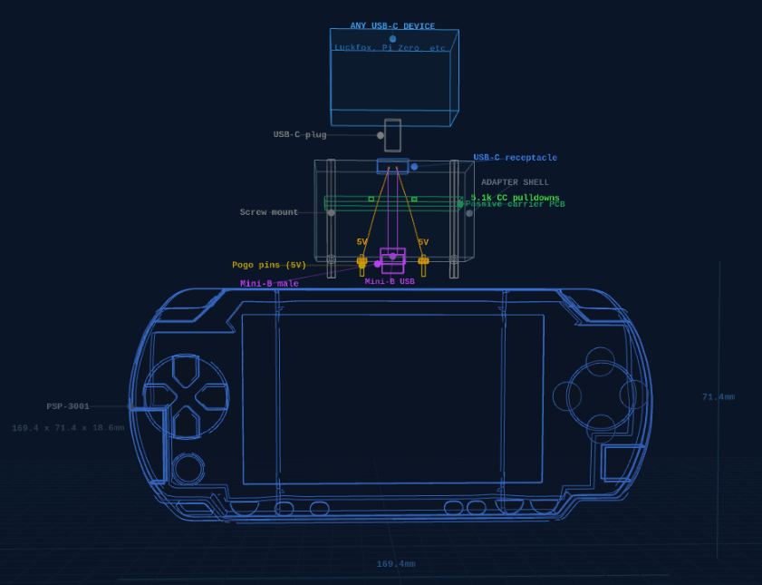
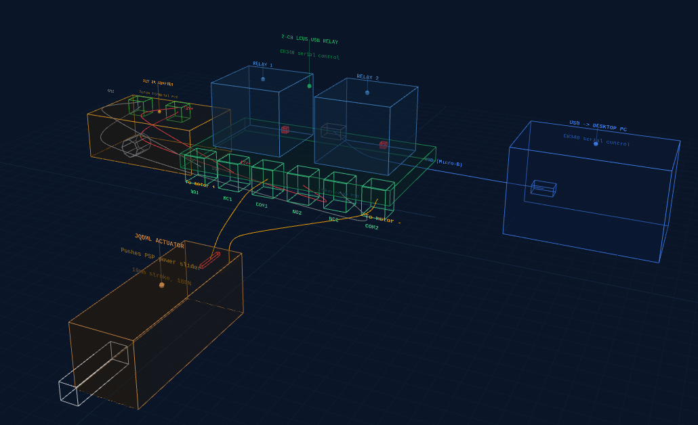

# OASIS_OS

An embeddable operating system framework in Rust. One codebase renders a full desktop environment -- window manager, browser engine, terminal, 15 apps, 17 skins -- to a 333 MHz PSP handheld, a desktop GPU, a web browser, and an Unreal Engine 5 viewport. Give it a pixel buffer and an input stream and it runs anywhere.

**[Try it in your browser](https://andrewaltimit.github.io/oasis-os/demo/)** -- no install required.

https://github.com/user-attachments/assets/8e12988e-fb1a-4a4e-a0e5-e1f04d8cd433

**[All 17 skin screenshots](SCREENSHOTS.md)** | **[Developer's Journal](https://andrewaltimit.github.io/oasis-os/journal/)**

| Altimit | Paper | XP | Win95 | Retro CGA |
|:---:|:---:|:---:|:---:|:---:|
|  |  |  |  |  |

| macOS | GNOME | Balatro | Solarized | Vaporwave |
|:---:|:---:|:---:|:---:|:---:|
|  |  |  |  |  |

## The PSP Story

OASIS_OS was built from scratch in Rust starting in early 2026, inspired by PSP homebrew shells like PSIX. The PSP is both the original muse and the most demanding target -- and the most interesting.

The PSP is a 2004 handheld with a 333 MHz MIPS CPU, 32 MB RAM, and firmware from 2008. Making a modern streaming video app work on it required:

- **TLS 1.3 in pure Rust** -- Sony's firmware ships SSL 3.0 with 2008 root CAs. We implemented native TLS 1.3 via `embedded-tls` on bare metal MIPS, discovering privileged instruction traps (`mfc0 $9` is COP0-protected on Allegrex), RSA handshake failures (need the `alloc` feature for RSA scheme advertisement), and DNS endianness bugs. This enables HTTPS connections to modern servers like archive.org.

- **Hardware H.264 video decode** -- The PSP's Media Engine is a second MIPS CPU dedicated to multimedia. No public documentation exists for using it from homebrew. We [reverse engineered the ME's RPC protocol](https://andrewaltimit.github.io/oasis-os/journal/07-psp-media-engine.html) -- 22 command IDs, 47 internal NIDs, the complete kernel driver chain -- discovered undocumented `sceMpegCreate` parameters in PMPlayer's source code, and achieved hardware-accelerated H.264 decode from Rust. A firmware deadlock at ~70 frames is handled by a kernel PRX watchdog that hooks `sceKernelWaitEventFlag` with a timeout, plus P/B-frame skipping for indefinite stable streaming.

- **In-memory video streaming** -- The TV Guide app streams MP4 from archive.org over TLS 1.3, demuxes on the fly, feeds H.264 NAL units to the ME for video and AAC frames to `sceAudiocodec` for audio, all in separate threads with lock-free queues and semaphore-based wakeup. No disk I/O during playback.

- **Kernel-mode overlay plugin** -- A separate PRX binary hooks `sceDisplaySetFrameBuf` to draw an overlay UI on top of any running game's framebuffer, with background MP3 playback via the ME.

- **Closed-loop remote development** -- A [TCP command server](https://andrewaltimit.github.io/oasis-os/journal/08-remote-dev-automation.html) inside the EBOOT provides WiFi-based build-deploy-reboot-test cycles, remote input injection, live framebuffer streaming, and arbitrary file upload. A network recovery EBOOT (154 KB, triggered by holding R-trigger on boot) makes the device unbrickable over WiFi. An AI agent used this infrastructure to debug the entire H.264 pipeline -- 30+ deploy-test iterations in a single session without touching the device.

https://github.com/user-attachments/assets/3d84aea5-969c-4f38-af67-c088a7c37764

*Closed-loop demo: AI agent connects to PSP over WiFi, launches TV Guide, tunes a channel, windows the app, then power-cycles via USB relay-controlled actuator -- zero human contact.*

Read the full technical deep dives in the [Developer's Journal](https://andrewaltimit.github.io/oasis-os/journal/).

## Hardware Blueprints

Interactive 3D diagrams of the custom hardware built for PSP development. Click to explore -- rotate, zoom, and hover for component details.

| PSP USB-C Adapter | PSP Hard Reset Relay |
|:---:|:---:|
| [](https://andrewaltimit.github.io/oasis-os/blueprint.html?diagram=psp-usb-adapter) | [](https://andrewaltimit.github.io/oasis-os/blueprint.html?diagram=psp-relay) |
| Passive bridge: power pads + Mini-B data into one USB-C port | H-bridge wiring: USB relay drives actuator for remote hard reboot |

## Architecture: Write Once, Render Anywhere

Core code never calls platform APIs directly. All rendering, input, networking, and audio flow through backend traits defined in `oasis-types`. Implement 13 methods and you have a working backend; opt into up to 53 more (across nine extension traits with default implementations) for accelerated rendering.


```mermaid
graph TD
    APP["<b>OASIS_OS</b><br/>oasis-core + 13 app crates<br/>29 widgets, browser, terminal<br/>17 skins, 110+ commands"]
    TRAITS["<b>Backend Traits</b><br/>SdiCore (13 required) / SdiBackend (53 optional)<br/>InputBackend / NetworkBackend / AudioBackend"]

    SDL["<b>SDL3</b><br/>Desktop + Pi"]
    WASM["<b>WASM</b><br/>Canvas 2D"]
    PSP["<b>PSP</b><br/>sceGu HW GPU"]
    UE5["<b>UE5</b><br/>RGBA FFI"]

    APP --> TRAITS
    TRAITS --> SDL
    TRAITS --> WASM
    TRAITS --> PSP
    TRAITS --> UE5

    style APP fill:#1a1a2e,stroke:#e94560,color:#eee
    style TRAITS fill:#16213e,stroke:#0f3460,color:#eee
    style SDL fill:#0f3460,stroke:#533483,color:#eee
    style WASM fill:#0f3460,stroke:#533483,color:#eee
    style PSP fill:#0f3460,stroke:#533483,color:#eee
    style UE5 fill:#0f3460,stroke:#533483,color:#eee
```

## Key Features

**Browser Engine**
- HTML/CSS renderer with DOM, CSS cascade, flex/table layout and CSS Grid (track lists, `repeat(auto-fill/auto-fit)`, named areas, auto-placement incl. `dense`), full 2D + 3D CSS transforms
- Custom properties with `var()` substituted at computed-value time (fallbacks, cycle detection, `calc(var(...))`)
- Canvas 2D path API, SVG paths with fill-rule/linecap/linejoin
- Light compositor: display list batching, occlusion culling, clip intersection, sticky scroll caching
- Hover-triggered CSS transitions, `@media`/`@supports`/`@container`/`@layer` queries, `calc()`
- Form elements with select dropdown, label association, Tab focus, GET/POST submission
- JavaScript engine: QuickJS-NG (via `rquickjs`) across every backend including real PSP hardware — a broad DOM API (cached node wrappers, tree mutation, `classList`/`dataset`, Event/CustomEvent classes, document lifecycle, `requestAnimationFrame`), a Promise-based `fetch()` with origin checks and CORS rules, per-origin quota'd `localStorage`/`sessionStorage`, and an execution watchdog so runaway scripts cannot freeze the OS. PSP bring-up required a pspdev cross-toolchain through the `cc` crate plus ~40 hand-written `quickjs_shim.rs` libc/libm symbols

**Shell & Apps**
- 110+ terminal commands and shell builtins with piping, globs, aliases, variable expansion, `if`/`while`/`for`/`case` scripting, background jobs (`cmd &`, `jobs`/`fg`/`kill`)
- Readline-style line editing, tab completion (commands, `$VARS`, VFS paths), Ctrl+R history search and persistent history
- 15 built-in apps: File Manager, Browser, TV Guide, Internet Radio, Music Player, Photo Viewer, Paint, Games, Calculator, Text Editor, Terminal, Settings, Network, Package Manager, System Monitor
- Apps get raw keyboard shortcuts (`App::handle_key`), per-frame ticks, and mutable VFS access for saves/renames/copies; e.g. the Text Editor has selection, clipboard, find/replace and syntax highlighting, the File Manager does copy/move/rename/delete with confirmation dialogs
- TV Guide streams video from Internet Archive with hardware H.264 decode (PSP) or software decode (desktop)
- Internet Radio streams MP3 from curated Internet Archive collections

**Rendering & UI**
- Scene graph (SDI) with z-order, gradients, rounded corners, shadows, alpha blending, and exact per-object dirty tracking so idle frames skip redraws
- 29 widgets (Button, Card, TabBar, ScrollView, Slider, TreeView, Modal, Table, ...) plus ListView, MenuBar, NinePatch, icon atlas and flex/grid layout helpers
- Window manager with drag/resize, minimize/maximize, drag-to-edge snapping, Alt+Tab, keyboard snapping, tiling layouts and open/close/minimize animations
- 17 built-in skins (14 also shipped as TOML) with theme derivation from 9 base colors
- Vector graphics with path operations and frame-driven animations
- GPU shader wallpapers (Shadertoy-style: Voronoi, City Lights, Ocean Waves, Balatro)

**Networking & Platform**
- TLS 1.3 in pure Rust via `embedded-tls` (enables HTTPS on PSP hardware)
- Software MP4/H.264+AAC video decode (desktop); hardware ME decode (PSP)
- Remote terminal with PSK authentication (loopback-only unless a PSK is set) for headless management
- Optional MCP control server (loopback, Origin/Host checks) so a local agent can drive the shell
- Plugin system with VFS-based IPC and manifest discovery
- Virtual file system: `MemoryVfs` (in-RAM), `RealVfs` (disk), `GameAssetVfs` (UE5)

**PSP-Specific**
- Hardware GU rendering via `sceGu` with sprite batching and VRAM texture cache
- Media Engine H.264 decode with kernel PRX watchdog for deadlock recovery
- WiFi auto-connect, TCP command server, remote input injection, live screencap
- Network recovery EBOOT for remote unbricking (154 KB, WiFi TCP file server)
- Kernel-mode overlay PRX: in-game UI + background MP3 via ME coprocessor
- Hardware AAC decode via `sceAudiocodec`, proportional bitmap + system TrueType fonts

## Skins

17 built-in skins, all data-driven TOML with theme derivation from 9 base colors. 14 of them also ship as editable TOML directories under [`skins/`](skins/); `corrupted`, `desktop` and `modern` are built-in only. No code changes are needed to add a skin -- see the [Skin Authoring Guide](docs/skin-authoring.md).

| Category | Skins |
|----------|-------|
| **Desktop** | xp, macos, gnome, win95, desktop, modern |
| **Dashboard (PSP-style)** | classic, altimit, psix-tribute, psix-hifi |
| **Aesthetic** | balatro, vaporwave, solarized, paper, retro-cga |
| **Terminal** | corrupted |
| **Accessibility** | highcontrast |

Skins support animated shader wallpapers (Shadertoy-style fragment shaders: Voronoi, City Lights, Ocean Waves, Calm Waves, Balatro) that render in real-time behind the UI.

Default virtual resolution is 480x272 (PSP native). Skins may override this (e.g. modern=800x600, xp=1024x768); the backend canvas/window scales to match.

## Crates

50 crate directories under `crates/`: 40 workspace members, plus the PSP backend (explicitly excluded from the workspace) and 9 standalone PSP-target crates built individually with `cargo psp`.

**Workspace members (40):**

| Layer | Crates | Description |
|-------|--------|-------------|
| **Foundation** | `oasis-types`, `oasis-vfs`, `oasis-platform`, `oasis-i18n` | Backend traits + input/geometry types, virtual file system, platform service traits, internationalization |
| **Rendering** | `oasis-sdi`, `oasis-ui`, `oasis-wm`, `oasis-skin`, `oasis-vector`, `oasis-shader`, `oasis-rasterize` | Scene graph, 29 widgets + layout helpers, window manager, 17 built-in skins, vector graphics, shader wallpapers, software rasterizer |
| **Content** | `oasis-browser`, `oasis-js`, `oasis-terminal`, `oasis-video`, `oasis-audio` | HTML/CSS/Gemini engine, QuickJS-NG, command interpreter, MP4/H.264+AAC decode, audio manager |
| **Infrastructure** | `oasis-net`, `oasis-mcp`, `oasis-core` | TCP/PSK networking + remote terminal, optional MCP control server, coordination layer (dashboard, agent, plugins, scripting) |
| **Apps** | `oasis-app-core` + 13 `oasis-app-*` crates | `App` trait and helpers; `-games`, `-paint`, `-text-editor`, `-calculator`, `-media` (Music Player + Photo Viewer), `-tv-guide`, `-radio`, `-settings`, `-file-manager`, `-browser`, `-network`, `-package-manager`, `-system-monitor` |
| **Backends** | `oasis-backend-sdl`, `oasis-backend-wasm`, `oasis-backend-ue5`, `oasis-ffi` | SDL3 desktop/Pi, Canvas 2D/browser, UE5 software framebuffer, C-ABI shared library |
| **Binaries & tools** | `oasis-app`, `oasis-usb-host`, `oasis-test-backend` | Desktop entry points (`oasis-app`, `oasis-screenshot`), host side of the PSP USB thin client, mock/recording backends for tests |

**PSP-only crates (built with `cargo psp`, not part of the workspace build):**

| Crate | Description |
|-------|-------------|
| `oasis-backend-psp` | The shell EBOOT: sceGu rendering, controller input, ME video decode (explicitly `exclude`d in `Cargo.toml`) |
| `oasis-plugin-psp` | Kernel-mode overlay PRX: in-game UI + background MP3 |
| `oasis-recovery-psp` | Network recovery EBOOT (WiFi TCP file server for unbricking) |
| `oasis-devloop-psp` | Remote dev-automation PRX (WiFi TCP command server) |
| `oasis-me-boot` | Minimal kernel PRX that boots the Media Engine (clean-room replacement for cooleyesBridge) |
| `oasis-prx-decrypt-psp` | Kirk-based flash0 PRX decryptor |
| `oasis-usb-client-psp`, `oasis-usb-debug-psp`, `oasis-usb-trace-psp`, `oasis-usb-vbus-psp` | USB thin-client driver and USB host-mode / VBUS research |

## Building

### Desktop (SDL3)

```bash
cargo build --release -p oasis-app

# Or via Docker (matches CI)
docker compose --profile ci run --rm rust-ci cargo build --release -p oasis-app
```

The default `oasis-app` features link against system ffmpeg (`video-decode-ffmpeg`). Without the ffmpeg development libraries (e.g. on Windows), build with the openh264 fallback instead:

```bash
cargo build --release -p oasis-app --no-default-features --features javascript,video-decode
```

See [Getting Started](docs/getting-started.md) for per-platform dependencies and the other feature flags (`skin-dev`, `mcp`).

### WebAssembly (Browser)

```bash
./scripts/build-wasm.sh --release    # requires wasm-pack
python3 -m http.server 8080          # serve at http://localhost:8080/www/
```

### PSP

```bash
# EBOOT (main application)
cd crates/oasis-backend-psp
RUST_PSP_BUILD_STD=1 cargo psp --release

# Kernel overlay plugin (PRX)
cd crates/oasis-plugin-psp
RUST_PSP_BUILD_STD=1 cargo psp --release

# Network recovery EBOOT
cd crates/oasis-recovery-psp
RUST_PSP_BUILD_STD=1 cargo psp --release
```

### UE5 (FFI Library)

```bash
cargo build --release -p oasis-ffi
```

### Screenshots

```bash
cargo run -p oasis-app --bin oasis-screenshot          # classic (default)
cargo run -p oasis-app --bin oasis-screenshot xp       # any skin by name
```

## Environment Variables

Read by the desktop binaries (`oasis-app`, `oasis-screenshot`) and the platform layer:

| Variable | Description | Example |
|----------|-------------|---------|
| `OASIS_SKIN` | Skin to start with (a CLI argument takes precedence); also picks the skin for `oasis-screenshot` | `OASIS_SKIN=modern cargo run -p oasis-app` |
| `OASIS_APP` | Auto-launch a dashboard app by title on startup | `OASIS_APP=Browser` |
| `OASIS_URL` | Initial browser URL (with `OASIS_APP=Browser`) | `OASIS_URL="vfs://sites/home/js-test.html"` |
| `OASIS_SKIP_SPLASH` | `1` skips the boot splash animation (init work still runs) | `OASIS_SKIP_SPLASH=1` |
| `OASIS_FRAME_STATS` | `1` logs per-phase frame timings (p50/p99) and drawn vs. skipped frames every ~5 s | `OASIS_FRAME_STATS=1` |
| `OASIS_FIXED_TIME` | Freeze the platform clock (status bar, TV Guide grid) for deterministic screenshots | `OASIS_FIXED_TIME="2026-01-01 12:00:00"` |
| `OASIS_FIXED_FRAME` | Shader wallpaper frame number used by `oasis-screenshot` (default 30) | `OASIS_FIXED_FRAME=0` |
| `OASIS_TV_CHANNEL` | Auto-tune this TV Guide channel number once the catalog loads (automated testing) | `OASIS_TV_CHANNEL=3` |
| `OASIS_TV_SEEK` | Override the seek position (seconds) when tuning a TV channel | `OASIS_TV_SEEK=120` |
| `OASIS_TV_TIMEOUT` | Exit N seconds after video decode starts (automated testing) | `OASIS_TV_TIMEOUT=30` |
| `OASIS_MCP` | `1` starts the MCP control server at boot (requires the `mcp` feature) | `OASIS_MCP=1` |
| `OASIS_MCP_PORT` | MCP server port (default 7345, loopback only) | `OASIS_MCP_PORT=7345` |
| `OASIS_MCP_TOKEN` | Optional bearer token the MCP server requires | `OASIS_MCP_TOKEN=secret` |

Test-only switches: `OASIS_E2E_NETWORK`, `OASIS_NETWORK_SCREENSHOTS` and `OASIS_LIVE_CSS` enable network-dependent `oasis-app` tests; `OASIS_SOAK_SECS` / `OASIS_SOAK_TICK_MS` tune the ignored radio soak test; `OASIS_LAYOUT_BUDGET_SCALE` scales the browser layout time budgets in `crates/oasis-browser/tests/layout_budget.rs`.

## PSP Remote Development

The PSP backend includes a TCP command server for closed-loop development. See the [Developer's Journal Entry 08](https://andrewaltimit.github.io/oasis-os/journal/08-remote-dev-automation.html) for the full design.

```bash
# Deploy EBOOT over WiFi
./scripts/psp-devloop.sh cycle target/.../EBOOT.PBP

# Remote UI control
./scripts/psp-devloop.sh tcp-press cross
./scripts/psp-devloop.sh tcp-screencap /tmp/psp.png

# Upload kernel plugin
./scripts/psp-devloop.sh tcp-upload oasis.prx ms0:/seplugins/oasis.prx
```

## PSP Testing (PPSSPP)

The repo includes a containerized PPSSPP emulator with NVIDIA GPU passthrough:

```bash
docker compose --profile psp build ppsspp                                                     # first time only
docker compose --profile psp run --rm ppsspp /roms/release/EBOOT.PBP                          # GUI (X11)
docker compose --profile psp run --rm -e PPSSPP_HEADLESS=1 ppsspp /roms/release/EBOOT.PBP --timeout=5  # headless
```

## CI

All CI runs in Docker on a self-hosted runner:

format check -> clippy -> nightly clippy -> docs -> markdown links -> tests -> release build -> screenshot regression -> cargo-deny -> benchmarks -> PSP EBOOT + PPSSPP headless -> coverage -> WASM deploy

## Documentation

The full index is [docs/README.md](docs/README.md). Highlights:

- [Getting Started](docs/getting-started.md) -- per-target setup (desktop, WASM, UE5/FFI, PSP), feature flags, testing
- [Technical Design](docs/design.md) -- architecture, backends, input model, window manager, skins, PSP, VFS, plugins, security
- [Writing Apps](docs/writing-apps.md) -- the `App` trait lifecycle, hooks and a minimal example app
- [UI Widgets](docs/ui-widgets.md) -- catalogue of `oasis-ui` widgets and layout helpers
- [Window Manager](docs/window-manager.md) -- `WindowManager` API, snapping, keyboard shortcuts, animations
- [Skin Authoring Guide](docs/skin-authoring.md) -- TOML reference, theme derivation, effects
- [Adding Commands](docs/adding-commands.md) and [Terminal Commands](docs/terminal-commands.md) -- command development and catalogue
- [Browser Engine](docs/browser-engine.md) and [oasis-js](docs/oasis-js.md) -- HTML/CSS feature catalogue, JS/DOM bindings
- [Plugin Development](docs/plugin-development.md) -- plugin API, VFS-based IPC
- [FFI Integration](docs/ffi-integration.md) -- C API for UE5 and external hosts
- [WASM Backend](docs/wasm-backend.md) -- building, serving and embedding the browser build
- [MCP Server](docs/mcp-server.md) and [Networking](docs/networking.md) -- agent control server, remote terminal, TLS
- [PSP Architecture](docs/psp-architecture.md) and [PSP Plugin Guide](docs/psp-plugin.md) -- PSP target and overlay PRX
- [Security](docs/security.md) and [Troubleshooting](docs/troubleshooting.md)
- [ADR Index](docs/adr/README.md) -- architectural decision records
- [Examples](examples/README.md) -- runnable examples
- [Developer's Journal](https://andrewaltimit.github.io/oasis-os/journal/) -- technical deep dives (TLS on PSP, ME reverse engineering, remote automation)

## Security Notice

> **OpenAI/Google integrations are disabled within PR reviews.** OpenAI/Google permits government partners unrestricted use of their models. We only allow models with explicit prohibitions on mass surveillance and autonomous weapons.

## License

Dual-licensed under [MIT](LICENSE-MIT) and [Unlicense](LICENSE).
