# OASIS_OS Screenshots

All screenshots are captured via `cargo run -p oasis-app --bin oasis-screenshot <skin>`.

## Dashboards

| Classic | XP | Modern | Desktop | macOS |
|:---:|:---:|:---:|:---:|:---:|
| 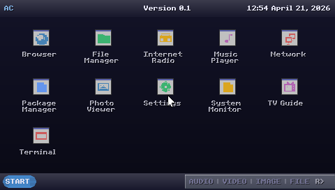 |  | 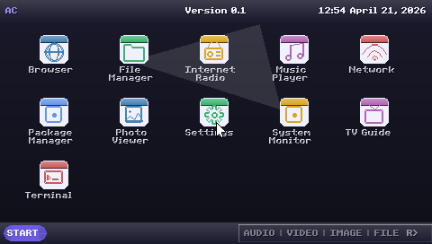 | 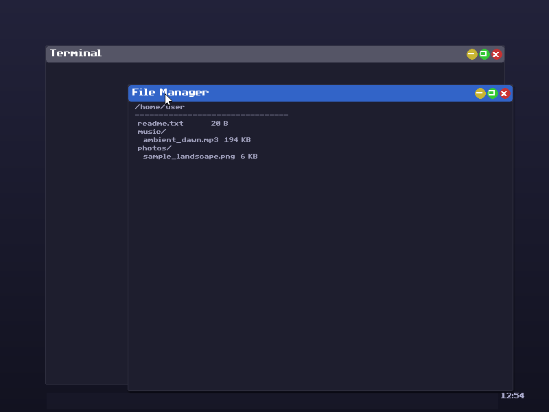 | 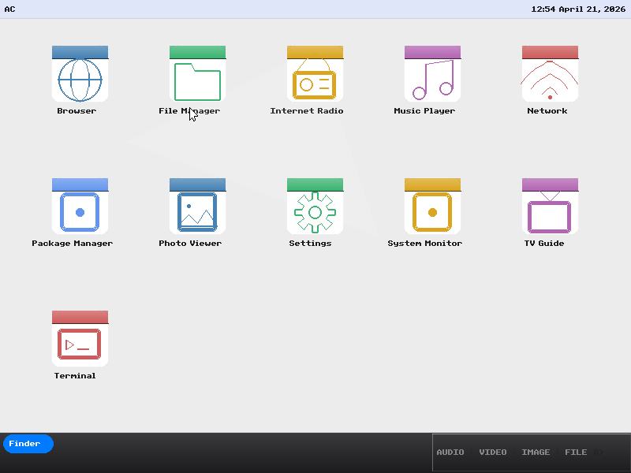 |

| GNOME | Balatro | Win95 | Solarized | Vaporwave |
|:---:|:---:|:---:|:---:|:---:|
| 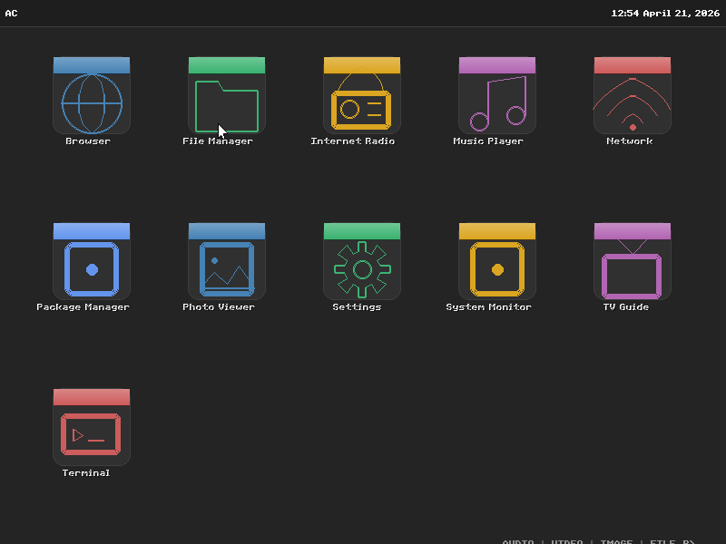 | 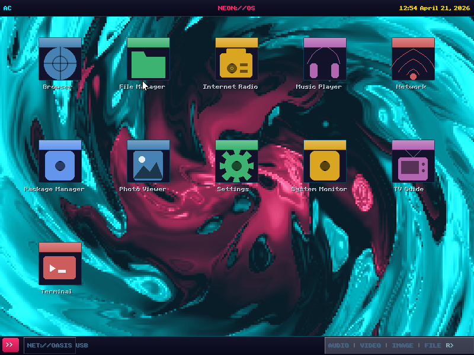 | 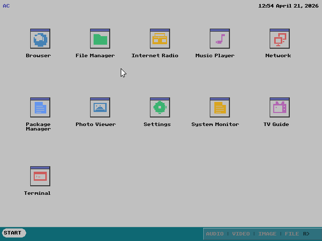 | 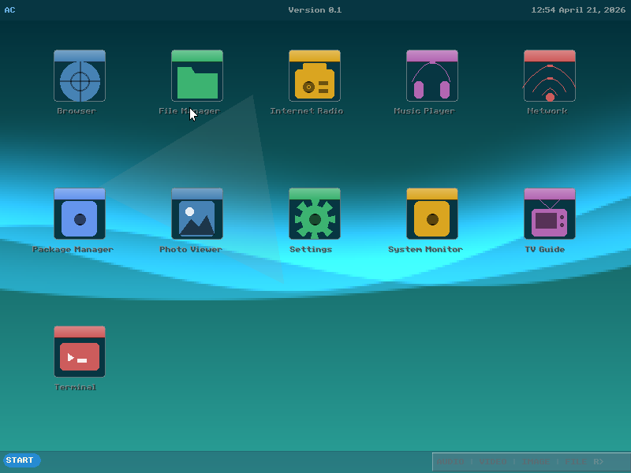 | 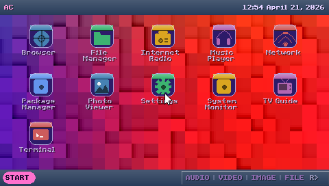 |

| Retro CGA | Paper | High Contrast | Altimit |
|:---:|:---:|:---:|:---:|
| 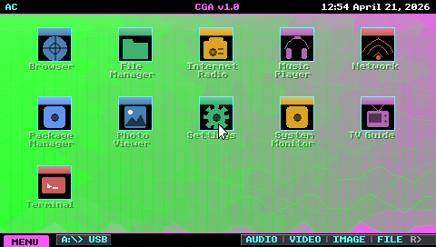 | 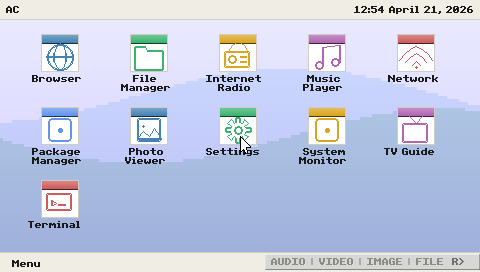 | 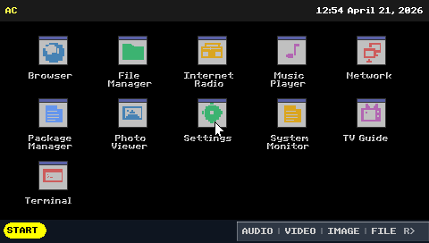 | 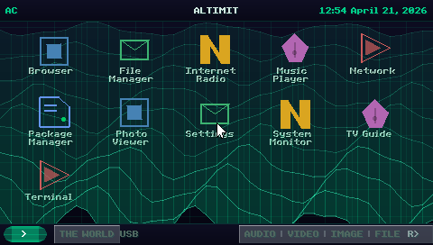 |

## Terminals

| Classic | XP | Modern | Desktop | macOS |
|:---:|:---:|:---:|:---:|:---:|
| 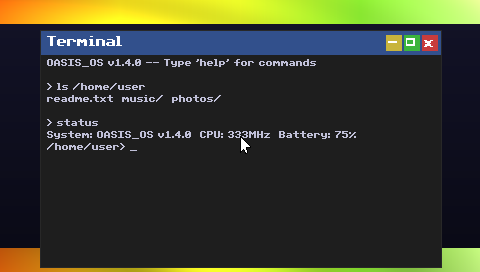 | 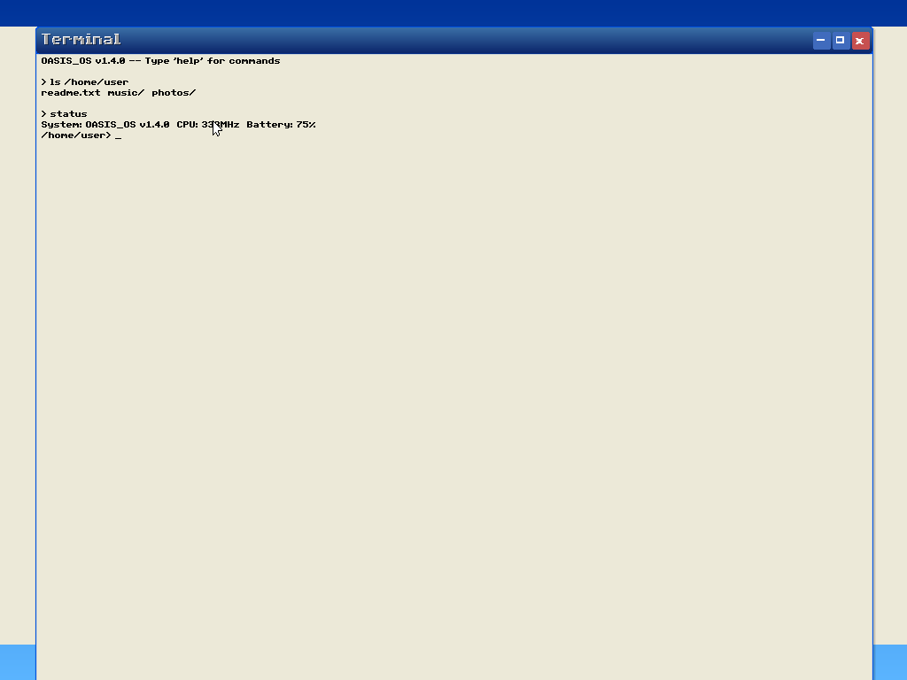 | 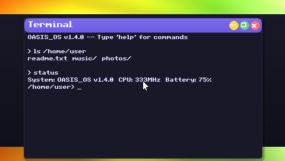 | 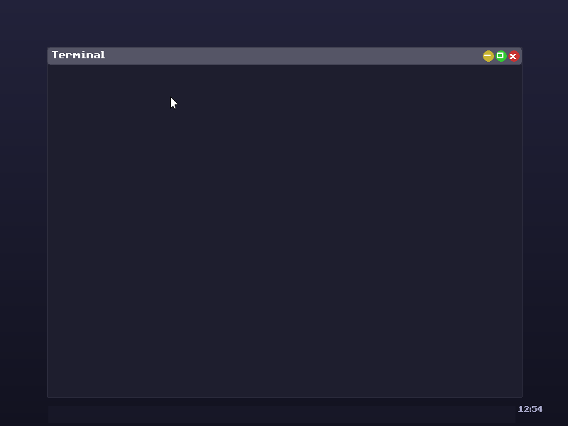 | 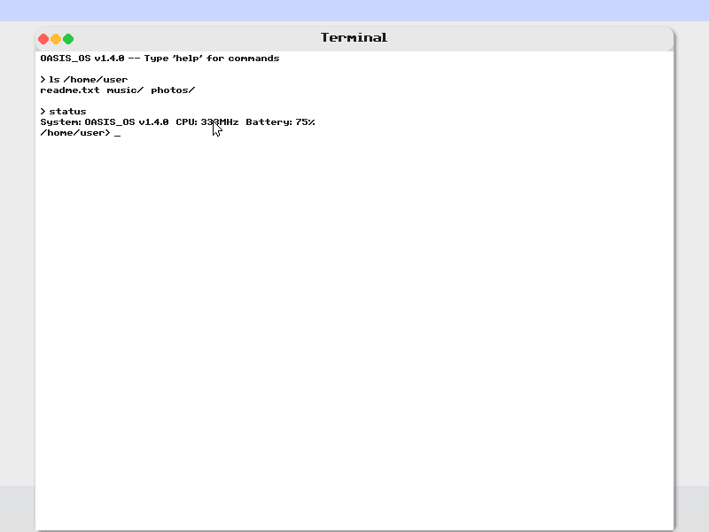 |

| Corrupted | Balatro | Win95 | Solarized | Vaporwave |
|:---:|:---:|:---:|:---:|:---:|
| 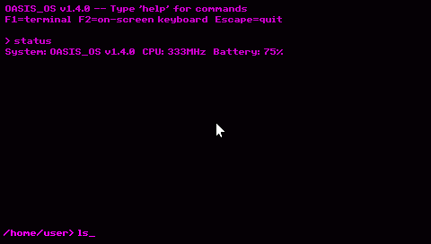 | 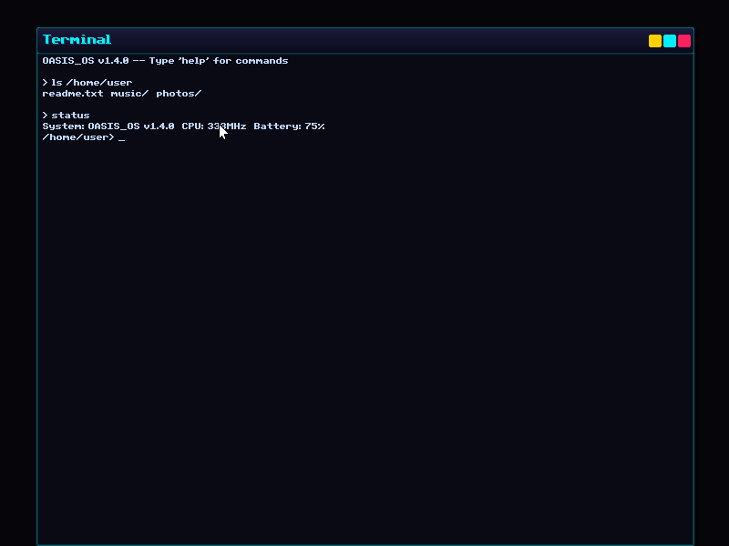 | 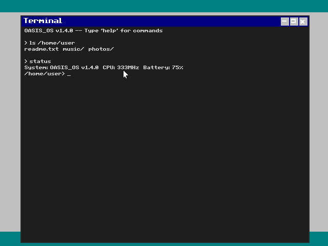 | 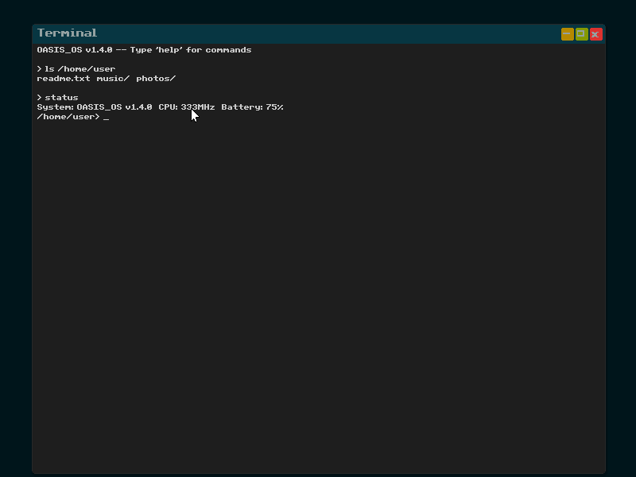 | 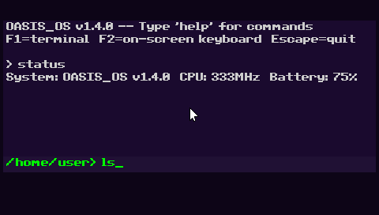 |

| High Contrast | GNOME | Retro CGA | Paper | Altimit |
|:---:|:---:|:---:|:---:|:---:|
| 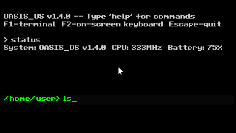 | 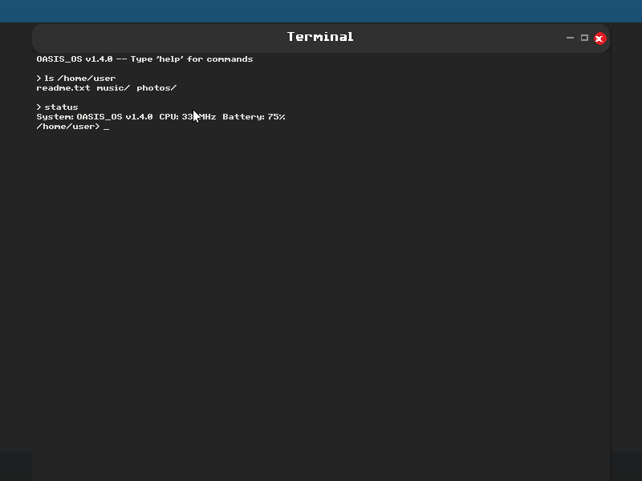 | 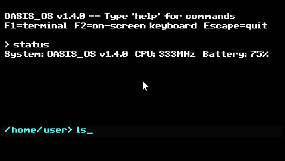 | 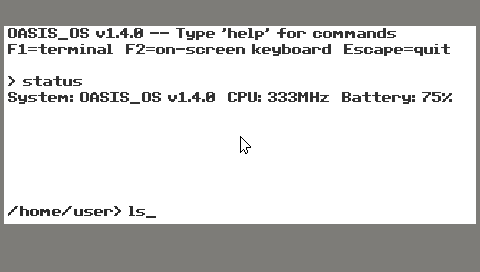 | 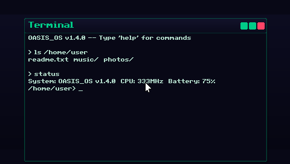 |

## Media Tabs

| Classic | XP | Modern |
|:---:|:---:|:---:|
| 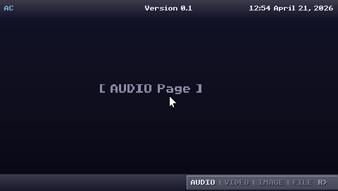 | 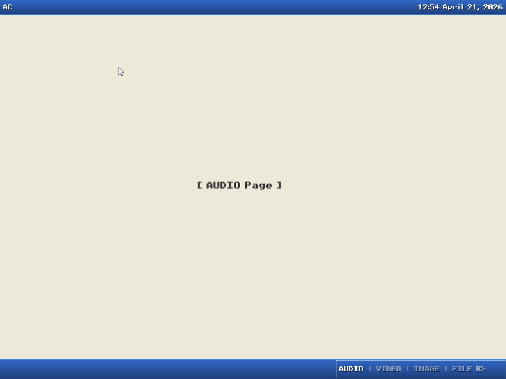 | 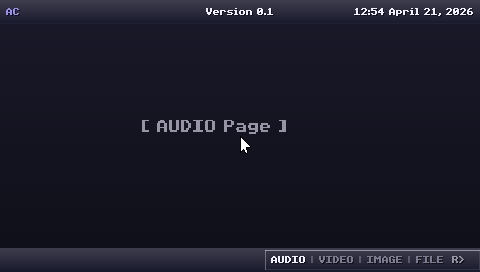 |

## Mods Tabs

| Classic | XP | Modern |
|:---:|:---:|:---:|
|  | 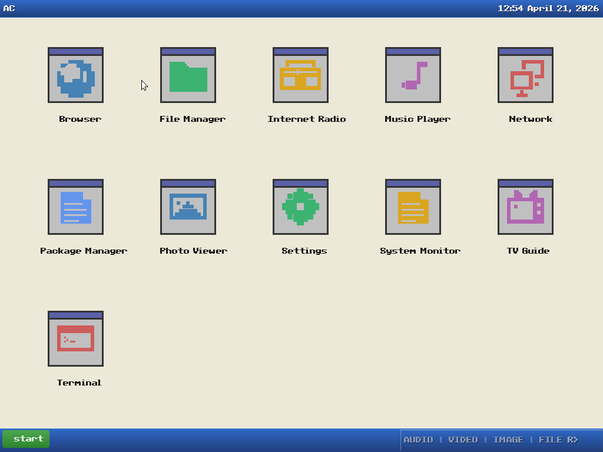 |  |

## Generating Screenshots

```bash
# All skins
for skin in classic xp modern desktop corrupted macos gnome balatro retro-cga paper win95 solarized vaporwave highcontrast altimit; do
  cargo run -p oasis-app --bin oasis-screenshot "$skin"
done
```
